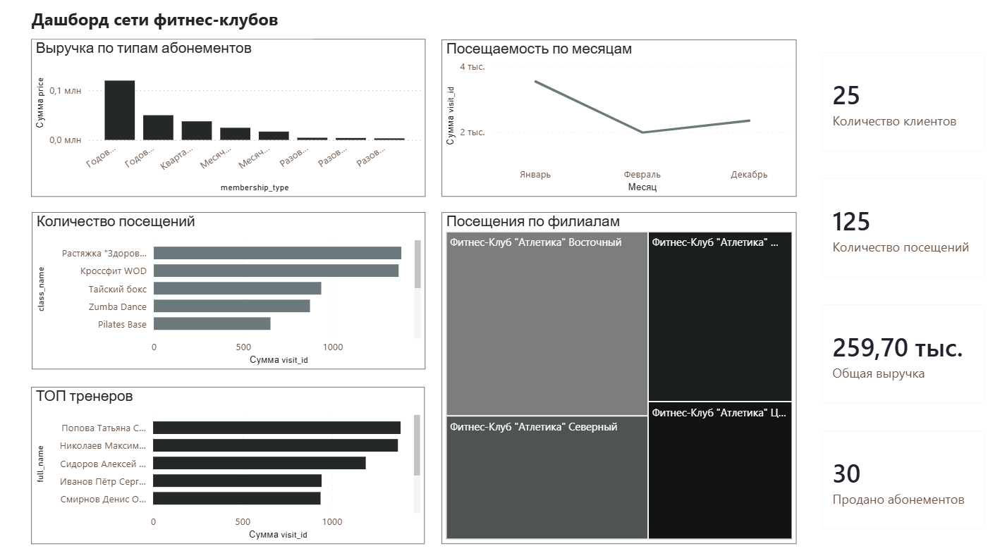

# Fitness Clubs Analytics

Учебный проект по проектированию базы данных, анализу данных и построению BI-дашборда для сети фитнес-клубов.

## Описание проекта

Цель проекта — разработать аналитическую систему для хранения данных о клиентах, тренерах, филиалах, занятиях, посещениях и абонементах, а также предоставить инструменты для анализа деятельности сети фитнес-клубов.

В рамках проекта были выполнены:

- проектирование структуры базы данных;
- создание базы данных в Microsoft SQL Server;
- заполнение тестовыми данными;
- разработка аналитических SQL-запросов;
- построение интерактивного дашборда в Microsoft Power BI;
- подготовка технической документации.

## Используемые технологии

- Microsoft SQL Server
- SQL
- Microsoft Power BI Desktop
- Microsoft Excel
- Git
- GitHub

## Структура базы данных

База данных состоит из следующих сущностей:

- Branches — филиалы сети;
- Trainers — тренеры;
- Classes — занятия;
- Clients — клиенты;
- Memberships — абонементы;
- Visits — посещения.

Связи между сущностями реализованы с использованием первичных и внешних ключей.

## Аналитика

Реализованы SQL-запросы для анализа:

- количества клиентов;
- количества посещений;
- посещаемости филиалов;
- популярности занятий;
- активности тренеров;
- продаж абонементов;
- общей выручки;
- средней стоимости абонементов;
- клиентов без посещений;
- динамики посещений.

Всего реализовано **20 SQL-запросов**.

## Dashboard

В Microsoft Power BI разработан интерактивный дашборд, содержащий:

- KPI по количеству клиентов;
- KPI по количеству посещений;
- KPI по общей выручке;
- KPI по количеству проданных абонементов;
- динамику посещаемости;
- популярность занятий;
- посещаемость филиалов;
- рейтинг тренеров.

> Ниже представлен пример итогового дашборда.



## Структура проекта

```text
FitnessClubsAnalytics
│
├── database
│   ├── FitnessClubs.sql
│   └── database_diagram.png
│
├── sql
│   └── analytics_queries.sql
│
├── dashboard
│   ├── FitnessClubsDashboard.pbix
│   └── dashboard.png
│
├── documentation
│   ├── Business Requirements.docx
│   ├── Data Dictionary.xlsx
│   └── User Guide.docx
│
└── README.md
```

## Как запустить проект

1. Открыть Microsoft SQL Server Management Studio.
2. Выполнить скрипт `database/FitnessClubs.sql`.
3. При необходимости выполнить аналитические запросы из `sql/analytics_queries.sql`.
4. Открыть файл `dashboard/FitnessClubsDashboard.pbix` в Microsoft Power BI Desktop.

## Документация

В репозитории представлены:

- Business Requirements;
- Data Dictionary;
- User Guide;

## Автор

Проект выполнен в рамках формирования портфолио по направлению Системная Аналитика.